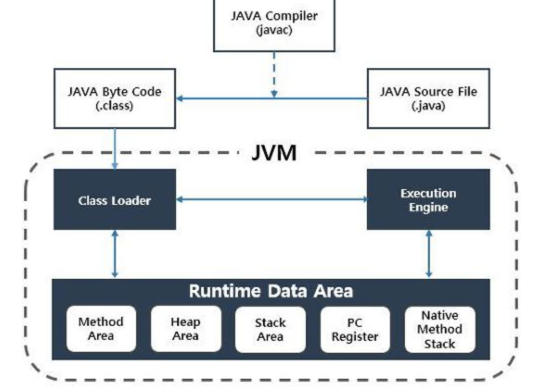

# 멋사 백엔드 스쿨 8주차 1일 : Java
## 기계어와 어셈블리어
#### 저급 언어 : 
- 기게어 : CPU가 입력받아 해석할 수 있는 0과1로 이루어진 명령어입니다.  
- 어셈블리어 : 기계어와 대응되는 사람이 읽을 수 있는 프로그래밍 언어 입니다.  

#### 고급언어 : 사람이 이해하기 편리한 언어
가독성이 좋고, 사람이 이해하기 편리한 언어 입니다.
( java, python, javascript, c++, c .. )
- 컴파일러 언어 : 실행 전에 기계어로 번역 되어 실행 시점에 빠르게 실행 됩니다. 
  - ex ) c, c++
- 스크립트 언어(인터프리터 언어) : 컴파일 단계없이 바로 실행되면서, 한 줄씩 해석되고 실행됩니다.
  - ex ) python

## JAVA
Java 언어 : Write Once Run Anywhere
- 한번 작성한 코드를 어떤 컴퓨터에서든 실행할 수 있습니다.


- Java code(.java) ➡️ (자바 컴파일러) ➡️ 바이트 코드(.class) ➡️ (JVM 로딩) ➡️ 기계어 


```
          +----------------------+
          |          JDK         |
          |                      |
          |  +--------------+    |
          |  |    javac     |    |
          |  +--------------+    |
          |  +--------------+    |
개발       |  |    java      |    |
환경  -->  |  +--------------+    |
          |          ...         |
          +----------------------+
                   ▲
                   |
                   | 포함
                   |
          +----------------------+
          |          JRE         |
          |                      |
          |  +--------------+    |
          |  |     JVM      |    |
          |  +--------------+    |
          |  +--------------+    |
실행       |  |  자바 클래스    |    |
환경  -->  |  |  라이브러리     |    |
          |  +--------------+    |
          |  +--------------+    |
          |  |  자바 실행환경  |    |
          |  +--------------+    |
          |          ...         |
          +----------------------+

by. chat gpt 3
```


#### JDK(Java Development Kit)
- 자바 애플리케이션 및 앱을 **개발하기 위해 필요한 도구와 라이브러리의 집합**입니다. 
- 자바 컴파일러(javac), 디버거(jdb), 실행환경(java), 개발 도구(javadoc 등), 테스트 도구(junit 등) 등이 포함되어 있습니다.
- 자바 소스 코드를 작성하고, 컴파일하여 바이트 코드로 변환한 후 실행할 수 있습니다. 
- 또한 자바 개발 환경을 설정하는 데 필요한 환경 변수나 설정 파일도 포함하고 있습니다.

#### JRE(Java Runtime Environment)
- JRE는 자바 애플리케이션을 **실행하기 위한 실행 환경만**을 제공합니다.
- 자바 가상 머신(JVM), 자바 클래스 라이브러리, 자바 실행환경(java) 등으로 구성되어 있습니다. 
- 컴파일된 자바 바이트 코드를 실행하여 애플리케이션을 구동합니다. 
- 자바 애플리케이션을 실행할 수 있지만, 개발 도구나 컴파일러는 포함되어 있지 않습니다.

즉 개발자라면 JDK, 일반 이용자라면 JRE를 설치하여 사용한다고 생각하면 됩니다.


### 자바 프로그래밍 언어 플랫폼
> 1.  **Java SE(Java Standard Edition)** : 가장 대중적인 자바 플랫폼으로 자바 언어의 대중적인 패키지를 포함하고 있습니다. 
> 데이터 처리, 입출력, 네트워킹, 멀티스레딩, GUI 개발 등이 포함됩니다.
> 2. **Java EE(Java Enterprise Edition)** : Java SE를 기반으로 한 상위 수준의 플랫폼으로, 기업 환경에서 대규모 애플리케이션을 개발하기 위한 기능을 제공합니다.
> Servlet과 JSON, REST 반응형 클라이언트 API, 웹소켓 등을 지원합니다.(웹 프로그래밍에 필요한 기능을 많이 포함한다.)
> 대규모, 다계층, 확장 가능하고 안정적이며 안전한 네트워크 애플리케이션을 개발하고 실행하기 위한 API 및 런타임 환경을 제공합니다.
> 3. **Java ME(Java Micro Edition)** : Java SE를 기반으로 한 플랫폼입니다.
> 피쳐폰, PDA폰, 셉톱박스, 프린터와 같은 작은 임베디드 기기들 같은 작은 기기를 다루는데 이용하는 에디션입니다.
> 4. **JavaFX**는 Java 플랫폼을 위한 사용자 인터페이스(UI) 툴킷 및 애플리케이션 프레임워크입니다. 
> Java SE의 일부로 포함되어 있으며, Java SE 기반의 애플리케이션과 함께 사용할 수 있습니다. 
> JavaFX는 Swing과 같은 다른 Java UI 툴킷과 비교하여 강력한 기능을 제공합니다


#### JAVA 버전을 선택할때 
- LTS(Long term support)를 선택합니다.
- 장기적으로 지원을 해줍니다.
- 현재 기준으로는 17로 프로젝트를 시작하는것이 좋고, 이후 예상으로는 21을 사용하면 됩니다.


#### 언어는 해석하는 방식이 정해져 있을까
- 언어의 사용방식을 고정하는것 보다는 다른 방식으로도 생각해볼 수 있다.  

### 코드 작성 도구
#### Code Editor
- notepad, visual code..
- 코드를 작성하는데 도움을 주는 도구로 가볍고 인터페이스가 단순합니다.
#### Ide 
- visual studio, intelliJ, eclipse
- 소스코드 컴파일, 프로젝트 실행, 버전관리 등을 제공합니다.
- 규모가 큰 어플리케이션 개발에 비교적 유리합니다. (Spring, Django, ..)

하지만 IDE는 도우미이고 IDE를 잘 사용하기 위해서는 자신이 사용하는 언어나 프레임워크가 어떻게 동작하는지 알아야 합니다.

# 인터넷 과 웹
### 인터넷 
인터넷이란?
TCP/IP 통신을 기반으로 연결된 컴퓨터가 이루는 연결망

웹 서비스 : 인터넷 상에서 제공되는 서비스  
웹 개발 : 이러한 웹 서비스를 개발하는 행위  

### Client-Server Model 
클라이언트 
- 인터넷에 연결된 장치
- 서비스를 요청하는 주체

서버 
- 사용자에게 전송될 데이터나 기능이 동작하는 컴퓨터
- 서비스 요청에 응답하는 주체

### URL(Uniform Resource Locator)
- 브라우저의 주소창에 들어가는것
- 자원이 어디에 있는지 나타내는 기준이다.

구조 : `<scheme>://<authority>:<port>/<path>?<query>#<anchor>`
- Scheme : 어떤 방식으로 요청하는지 (Ftp, Http, Https ..)
- Authority : 어디에 요청을 보내는지 (www.google.com, www.naver.com..)
- Port : 포트 번호 (8080, 80, 4000..)
- Path : 자원의 위치 (/path/to/resouce)
- Query : 요구사항 (/userName=test&age=25)
- Fragment, Anchor : Html 문서내에 특정 섹션, 요소를 가리킴(#section1)

### 인터넷에서 자원을 식별하는 개념
> - URI (Uniform Resource Identifier) : 리소스를 식별하는 일반적인 개념
> - URL (Uniform Resource Locator) : 리소스의 위치를 나타내는 문자
> - URN (Uniform Resource Name) : 리소스의 이름을 나타내는 문자열  
> ```
>                     +--------------------+
>                     |  URI (Identifier)  |
>                     +--------------------+
>                                |
>               +--------------------------------+
>               |                                |
>     +-----------------+                +---------------+
>     |  URL (Locator)  |                |   URN (name)  |
>     +-----------------+                +---------------+
>```

## 프레임워크의 역할
- 반복되는 기능들을 프레임워크가 대신 해주어 비즈니스 로직에 집중할 수 있도록 도와준다.

### Spring initializr 
- 프레임워크 사용시에 필요한 의존성(라이브러리)를 쉽게 주입
- 버전에 맞춰서 의존성을 맞춰준다
- .gitignore등을 도와준다.
- 아래 프로젝트 에서는 타임리프와 웹 의존성을 추가하였습니다.

### Controller test 해보기 
```Java
package com.lahee.psSocial.controller;

import org.springframework.stereotype.Controller;
import org.springframework.web.bind.annotation.GetMapping;
import org.springframework.web.bind.annotation.RequestMapping;

@Controller
public class DemoController {
    @GetMapping("/home")
    public String home() {
        return "home";
    }

    @RequestMapping("/profile")
    public String profile() {
        return "profile.html";
    }
}
```

src/main/resources/templates/home.html
```html
<!DOCTYPE html>
<html lang="en">
<head>
    <meta charset="UTF-8">
    <title>HOME</title>
</head>
<body>
here is home
</body>
</html>
```

src/main/resources/templates/profile.html
```html
<!DOCTYPE html>
<html lang="en">
<head>
  <meta charset="UTF-8">
  <title>Profile</title>
</head>
<body>
here is juhee's profiles
</body>
</html>
```

참고로 디버그 출력이 필요한 경우 아래를 properties파일이나 yml파일에 추가하면 됩니다.
```properties
logging.level.org.springframework.web=DEBUG
```

```yml
logging:
  level:
    org.springframework: DEBUG
```


### 💡Question : @GetMapping vs @RequestMapping 
두 방법 모두 Spring Framework에서 URL을 매핑하는데 사용되는 어노테이션 입니다.
`@GetMapping`은 GET 요청에 대한 매핑을 간단하게 처리하는 데 사용되고  
`@RequestMapping`은 더 일반적인 경우에 사용되어 모든 HTTP 요청 메서드에 대한 매핑을 정의할 수 있습니다.  

즉 `@RequstMapping("/")` 로 정의할 시에 Get,Post,Put등 다양한 메서드로 접근할 수 있지만  
`@GetMapping("/")` 은 Get 요청 메서드에 대해서 처리합니다.  

추가로 @RequestMapping내에 메소드 파라미터를 주어 Get요청만 처리하게 수정할 수 있습니다. 
` @RequestMapping(value = "/", method = RequestMethod.GET) ` 

# Spring
## IOC

이전까지는 개발자가 자신이 필요로 하는 기능을 위해서 클래스로 객체를 생성하고 사용했습니다.  
하지만 현재 위의 코드에서 우리는 @Controller, @RequestMapping 사용하고, SpringApplication.run()을 하여 실행시켰습니다.  
즉 객체를 우리가 직접 만들지 않았고 프레임 워크가 제어해 주었습니다.  
클래스를 만드는건 우리지만 클래스 인스턴스가 언제 만들어 주는지 결정하는 주체가 Spring boot 입니다.  
(여기서 코드를 제어하는 주체가 반전되는 현상인 제어반전 Inverion of Control 패턴을 확인할 수 있습니다.)

### Inversion of Controller
개발자가 작성한 클래스와 설정정보를 바탕으로 클래스의 LifeCycle을 관리하는 Spring IOC패턴 구현체가 관리합니다.
Ioc Container == Spring container, Application Context
Ioc Container가 관리하는 객체를 Bean 이라고 부릅니다.
객체가 필요한 시점에 IOC 컨테이너에서 가져다가 사용하는 형태로 동작합니다.
SpringApplication.run() 메소드는 실행된 Spring Boot Application의 ApplicationContext (IoC Container)를 반환하는데 해당 부분을 출력해보면 bean의 생성여부를 확인할 수 있습니다.

### @SpringBoot

```java
@SpringBootApplication
public class PsSocialApplication {

	public static void main(String[] args) {
		ApplicationContext applicationContext = SpringApplication.run(PsSocialApplication.class, args);
		for (String beanDefinitionName : applicationContext.getBeanDefinitionNames()) {
			System.out.println(beanDefinitionName);
		}
	}

}
```
bean이 조회되는것을 확인할 수 있습니다.

### @EnableAutoConfiguration

```java
@EnableAutoConfiguration
public class PsSocialApplication {

	public static void main(String[] args) {
		ApplicationContext applicationContext = SpringApplication.run(PsSocialApplication.class, args);
		for (String beanDefinitionName : applicationContext.getBeanDefinitionNames()) {
			System.out.println(beanDefinitionName);
		}
	}

}
```
이렇게 하면 빈이 조회 되지 않는것을 확인할 수 있습니다.  
Bean 객체 검사 기준인 @ComponentScan이 사라져서 스캔하지 못하는 상황입니다.  
`@ComponentScan`: 스프링 컴포넌트 스캔을 활성화하고, 지정된 패키지 또는 클래스를 기반으로 컴포넌트를 찾아 등록하는 데 사용됩니다


`@SpringBootApplication`은 실제로는 세가지 어노테이션이 합쳐진 어노테이션입니다.
- @SpringBootConfiguration : 컨텍스트에서 추가 빈을 등록하거나 추가 구성 클래스를 가져올 수 있도록 설정합니다.
- @EnableAutoConfiguration
- @ComponentScan : 애플리케이션이 있는 패키지에서 컴포넌트 스캔을 활성화합니다.


`@ComponentScan(basePackages={”com.lahee.demo”})` 과 같이 basePackages로 패키지를 설정할 수 도 있습니다.  
따로 베이스 패키지 지정 하지 않으면 기본적으로 현재 **`@ComponentScan`** 어노테이션이 선언된 클래스가 속한 패키지가 기본 패키지로 사용됩니다.


# References(참고)
[☕ JDK / JRE / JVM 개념 & 구성 원리 💯 총정](https://inpa.tistory.com/entry/JAVA-%E2%98%95-JDK-JRE-JVM-%EA%B0%9C%EB%85%90-%EA%B5%AC%EC%84%B1-%EC%9B%90%EB%A6%AC-%F0%9F%92%AF-%EC%99%84%EB%B2%BD-%EC%B4%9D%EC%A0%95%EB%A6%AC)  
[Java EE 와 SE 의 개념과 차이](https://doozi316.github.io/java/2020/07/01/WEB20/)  
[[JAVA] 자바 프로그램 실행 과정 및 기본 구조](https://pienguin.tistory.com/entry/JAVA-%EC%9E%90%EB%B0%94-%ED%94%84%EB%A1%9C%EA%B7%B8%EB%9E%A8-%EC%8B%A4%ED%96%89-%EA%B3%BC%EC%A0%95-%EB%B0%8F-%EA%B8%B0%EB%B3%B8-%EA%B5%AC%EC%A1%B0)    
[https://dkswnkk.tistory.com/416](https://dkswnkk.tistory.com/416)
